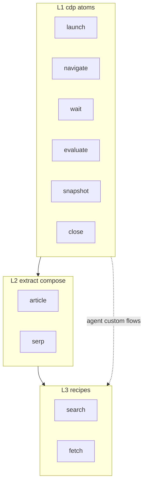

# Agent Instructions

## Project overview

**chrome-skills** extracts, normalizes, and maintains agent skills from Chrome capabilities. The goal is to give coding agents reliable workflows for browser automation, DevTools, and Chrome platform APIs.

This repo contains **skills and documentation** — not a Chrome extension, browser app, or MCP server implementation.

The published catalog currently centers on a **single hub skill, `chrome`**. Capabilities are internal commands (`cdp`, `extract`, `search`, `fetch`) composed in layers, not separate top-level skills. This reduces context overhead while keeping workflows atomic and composable.

## Repository map

| Path | Purpose |
|------|---------|
| `skills/<skill-name>/SKILL.md` | Canonical, committed, publishable skills — **only** edit skills here |
| `skills-lock.json` | Locked references to vendored tooling skills (e.g. `skill-creator`); do not hand-edit hashes |
| `.agents/skills/` | Local Cursor/runtime copies — gitignored, not source of truth |
| `.claude/skills/` | Local Claude Code copies — gitignored, not source of truth |
| `README.md` | Human-facing overview; link here instead of duplicating marketing copy |

When adding or changing a skill, work in `skills/`. Never treat `.agents/skills/` or `.claude/skills/` as the canonical location.

### `chrome` hub paths

| Path | Purpose |
|------|---------|
| `skills/chrome/SKILL.md` | Command router and index — the only skill body that should stay resident |
| `skills/chrome/references/<command>.md` | Per-command workflows; load on demand |
| `skills/chrome/references/output-schemas.md` | JSON output contracts |
| `skills/chrome/references/cdp-patterns.md` | agent-browser concept mapping (reference only) |
| `skills/chrome/scripts/` | CLI entrypoints (`cdp`, `extract`, `search`, `fetch`) |
| `skills/chrome/scripts/lib/` | CDP client, extractors, recipes — edit implementation here |
| `skills/chrome/scripts/setup` | Installs Python deps into `scripts/vendor/` |
| `skills/chrome/examples.md` | Copy-paste composition examples |

Edit command logic under `skills/chrome/scripts/lib/`. Do not edit `.agents/skills/chrome/` as canonical source.

## Hub skill command architecture



| Layer | Command | Session | Role |
|-------|---------|---------|------|
| L1 | `cdp <action>` | `launch` creates; others require `--session` | Browser lifecycle and page ops |
| L2 | `extract <mode>` | Required `--session` | Structured extraction from current page |
| L3 | `search`, `fetch` | Internal (launch→…→close) | High-frequency one-shot recipes |

**Routing** (when user invokes `/chrome`):

1. Parse first token: `cdp` | `extract` | `search` | `fetch`
2. Read **only** `skills/chrome/references/<token>.md`
3. For `cdp`, second token is the action; for `extract`, second token is the mode
4. Run matching script under `skills/chrome/scripts/`; scripts emit JSON to stdout

**Extension priority** (do not create a new top-level skill for each capability):

1. CDP can express it → add `cdp` action
2. Fixed JSON schema extraction → add `extract` mode
3. High-frequency end-to-end task → add recipe command (composes existing layers)

Default `disable-model-invocation: true` on `chrome` — explicit `/chrome` invocation only.

## Skill authoring conventions

Each skill lives at `skills/<skill-name>/SKILL.md` with required YAML frontmatter:

```markdown
---
name: skill-name
description: Third-person WHAT + WHEN triggers (max ~1024 chars)
disable-model-invocation: true
---
```

Rules:

- **`name`** — lowercase letters, numbers, hyphens only; max 64 characters
- **`description`** — third person; include both capabilities and trigger terms (agents under-trigger skills without explicit WHEN clauses)
- **`disable-model-invocation: true`** — default unless ambient auto-trigger is intentional
- Keep `SKILL.md` lean; put depth in `references/`, `examples.md`, or `scripts/`
- No secrets, API keys, or credentials in skill files

### `chrome`-specific conventions

- Keep `skills/chrome/SKILL.md` at command-index level (target under 500 lines)
- Every new command needs:
  - Entry in `SKILL.md` command table
  - `references/<command>.md` workflow doc
  - Executable `scripts/` entry (or subcommand of `cdp` / `extract`)
  - JSON fields in `references/output-schemas.md`
- Recipe commands must document equivalent `cdp` + `extract` steps in their reference file
- Use `references/cdp-patterns.md` for agent-browser alignment; do not add agent-browser CLI as a runtime dependency
- Sessions live in `~/.cache/chrome-skill/sessions/`; always close with `cdp close`

Optional bundled resources (general pattern):

```text
skills/<skill-name>/
├── SKILL.md
├── references/
├── examples.md
└── scripts/
```

## Chrome capability domains

| Domain | v1 status | Location |
|--------|-----------|----------|
| CDP / browser automation | Implemented | `chrome` commands (`cdp`, `extract`, `search`, `fetch`) |
| Chrome DevTools MCP | Not implemented | Future independent skill or `chrome` sub-domain |
| Extension / Platform APIs | Not implemented | Future skill or `chrome` command |

### CDP / browser automation

Navigation, extraction, search, fetch. Implemented via Python CDP scripts in `skills/chrome/scripts/`. Prefer composable `cdp` atoms over one-off shell. List Chrome/Chromium and `scripts/setup` prerequisites in references.

### Chrome DevTools MCP

Performance audits (Core Web Vitals), network debugging, accessibility checks, trace analysis. Document required MCP server setup and which tools the agent should call. Do not assume DevTools MCP is enabled by default.

### Extension / Platform APIs

Distill official Chrome documentation into agent workflows. Put Chrome doc URLs in `references/`, not in the `SKILL.md` body. Do not invent APIs — verify against [Chrome for Developers](https://developer.chrome.com/) or Context7 before writing.

## Creating or editing skills

**Default workflow** — extend `skills/chrome/`:

1. Decide layer: `cdp` action, `extract` mode, or recipe command
2. Implement in `scripts/lib/`; wire CLI in `scripts/`
3. Add or update `references/<command>.md` and `output-schemas.md`
4. Add entry to `SKILL.md` command index; add example to `examples.md` if non-obvious
5. Run `skills/chrome/scripts/setup` then smoke-test CLI
6. Validate frontmatter when touching `SKILL.md`:

```bash
python .agents/skills/skill-creator/scripts/quick_validate.py skills/chrome
```

**New top-level skill** (exception) — only for an independent domain:

1. Read bundled `skill-creator`: `.agents/skills/skill-creator/SKILL.md`
2. Create `skills/<skill-name>/SKILL.md` with frontmatter and instructions
3. Test and validate as above

Commit only under `skills/` — not under `.agents/skills/` or `.claude/skills/`.

## Code change principles

- Smallest correct diff; no unrelated refactors
- Match structure and tone of existing `chrome` commands when extending
- Comments only for non-obvious Chrome, CDP, or MCP behavior
- No build tooling, `package.json`, or CI unless explicitly requested

## Verification before claiming done

- [ ] `SKILL.md` has valid `name` and `description` frontmatter
- [ ] New commands appear in `SKILL.md` command index
- [ ] Workflow steps are executable (commands are copy-pasteable)
- [ ] `scripts/setup` run; CLI smoke tests pass
- [ ] Sessions cleaned up with `cdp close` in tests
- [ ] Prerequisites listed (Chrome/Chromium, Python, `scripts/setup`)
- [ ] No invented APIs — verified against official or Context7 docs
- [ ] Changes under `skills/`, not gitignored runtime directories
- [ ] `scripts/vendor/` and `__pycache__/` not committed

## What not to do

- Do not commit `.agents/skills/` or `.claude/skills/` as canonical skills
- Do not duplicate README content in AGENTS.md — keep this file operational
- Do not hand-edit hashes in `skills-lock.json`
- Do not add tests, CI, or package scaffolding unless explicitly requested
- Do not split every Chrome capability into a separate top-level skill — extend `chrome` commands instead
- Do not pile command details into `SKILL.md` — use `references/`
